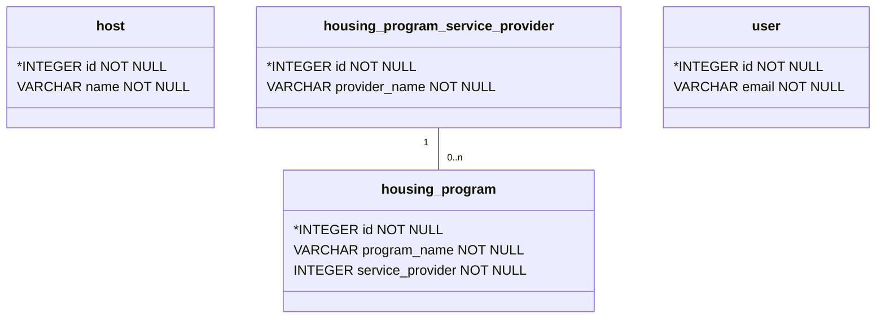

# Data Model



## Data Model Generation

Our data model is autogenerated using `eralchemy2`. The `eralchemy2` tool relies on `pygraphviz` and `graphviz` which are not easily installed using pip. The tool is easier to install on linux than windows, but instructions are provided for both operating systems.

### Linux Install

```bash
sudo apt install graphviz libgraphviz-dev pkg-config
python3 -m pip install pygraphviz
python3 -m pip install eralchemy2
```

### Windows Install

```pwsh
# If you don't have the choco package manager then
# exe installers are available https://graphviz.org/download/
choco install graphviz
python -m pip install --use-pep517 `
    --config-settings="--global-option=build_ext" `
    --config-settings="--global-option="-IC:\Program Files\Graphviz\include" `
    --config-settings="--global-option="-LC:\Program Files\Graphviz\lib" `
    pygraphviz
python -m pip install eralchemy2
```

### Model Generation

Once `eralchemy2` is installed, you can generate the ER diagram using these commands.

```shell
eralchemy2 -i "sqlite:///./homeuniteus.db" -o "HomeUniteUsDataModel.md" 
```
