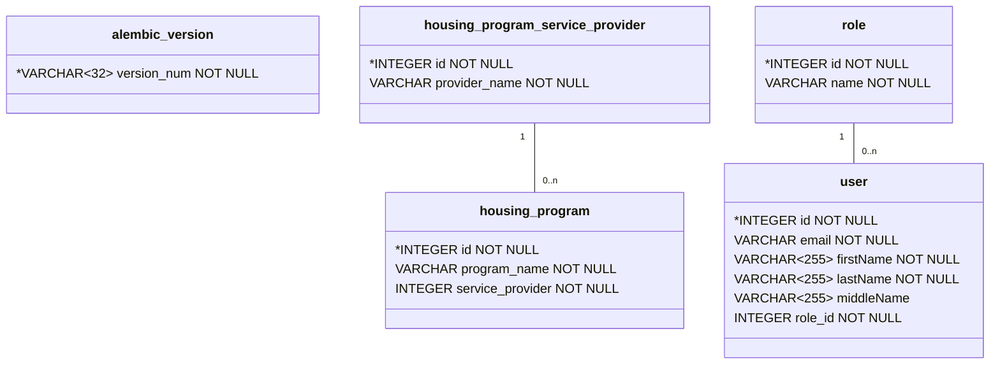

# Data Model



Notes:

* The `role` table is pre-populated with four roles by the `alembic` migration script:
  * Guest, Host, Coordinator, Admin

## How to update the Data Model

The HomeUniteUs database is versioned, using `alembic`. Every change to the database model increments the database version number, and must be submitted with a database migration script that is capable of upgrading and downgrading the database.

When changing the database, you can automatically generate an alembic migration. The autogenerated migration scripts can [fail to detect a number of changes](https://alembic.sqlalchemy.org/en/latest/autogenerate.html#what-does-autogenerate-detect-and-what-does-it-not-detect), so you should always review, test, and possibly edit the migration scripts before committing the update.

The recommended steps for developing the database model are as follows:

### 1. Backup your local database

Errors in the `alembic` migration script can corrupt your local data. Take a copy of your database before applying new migration scripts.

### 2. Update the python `Model` objects

Implement your model changes by updating the `sqlalchemy` model objects within the `models` project. Most models are within `database.py`, but they may be placed elsewhere in the future.

### 3. Autogenerate a migration script

Run `alembic revision --autogenerate -m <name_of_migration>` to generate a new migration. The autogenerated scripts often times miss important migration changes, but they provide an excellent start.

### 4. Test and manually edit migration script

Our test suite includes `alembic` migration tests that cycle up and down through the entire database history to check for common migration errors. A great way to test your new migration script is to run:

`pytest -k test_alembic_migration`

Fix any errors. Once the script passes our common tests, please add additional tests to `test_alembic_migration` that capture the newly introduced model requirements.

### 5. Apply the new script to your local db copy

Apply the final migration script to a copy of your local database by:

1. Name your local copy `api\homeuniteus.db`
2. Upgrade the database `alembic upgrade head`

You can verify your change was successful by viewing the database objects directly, and querying the database. If you are using `SQLite` then you can view the database objects using tools like [DB Browser](https://sqlitebrowser.org/).

### 6. [Optional] Update & test the model schema

If your model objects need to be (de)serialized (to)from json then add a schema object using `marshmallow_sqlalchemy.SQLAlchemyAutoSchema`. The schema object should contain all of the serialization related validation logic.

Each submitted schema change should include test cases to verify the serialization rules and validation. See `tests/test_schema.py` for examples.

### 7. Update the data model diagram

Follow the steps in [Data Model Generation](#data-model-generation) to create a new mermaid diagram of the updated datamodel. Add the new model to the [Data Model section](#data-model).

## Data Model Generation

Our data model is autogenerated using `eralchemy2`. The `eralchemy2` tool relies on `pygraphviz` and `graphviz` which are not easily installed using pip. The tool is easier to install on linux than windows, but instructions are provided for both operating systems.

### Linux Install

```bash
sudo apt install graphviz libgraphviz-dev pkg-config
python3 -m pip install pygraphviz
python3 -m pip install eralchemy2
```

### Windows Install

```pwsh
# If you don't have the choco package manager then
# exe installers are available https://graphviz.org/download/
choco install graphviz
python -m pip install --use-pep517 `
    --config-settings="--global-option=build_ext" `
    --config-settings="--global-option="-IC:\Program Files\Graphviz\include" `
    --config-settings="--global-option="-LC:\Program Files\Graphviz\lib" `
    pygraphviz
python -m pip install eralchemy2
```

### Model Generation

Once `eralchemy2` is installed, you can generate the ER diagram using these commands.

```shell
eralchemy2 -i "sqlite:///./homeuniteus.db" -o "HomeUniteUsDataModel.md" 
```
