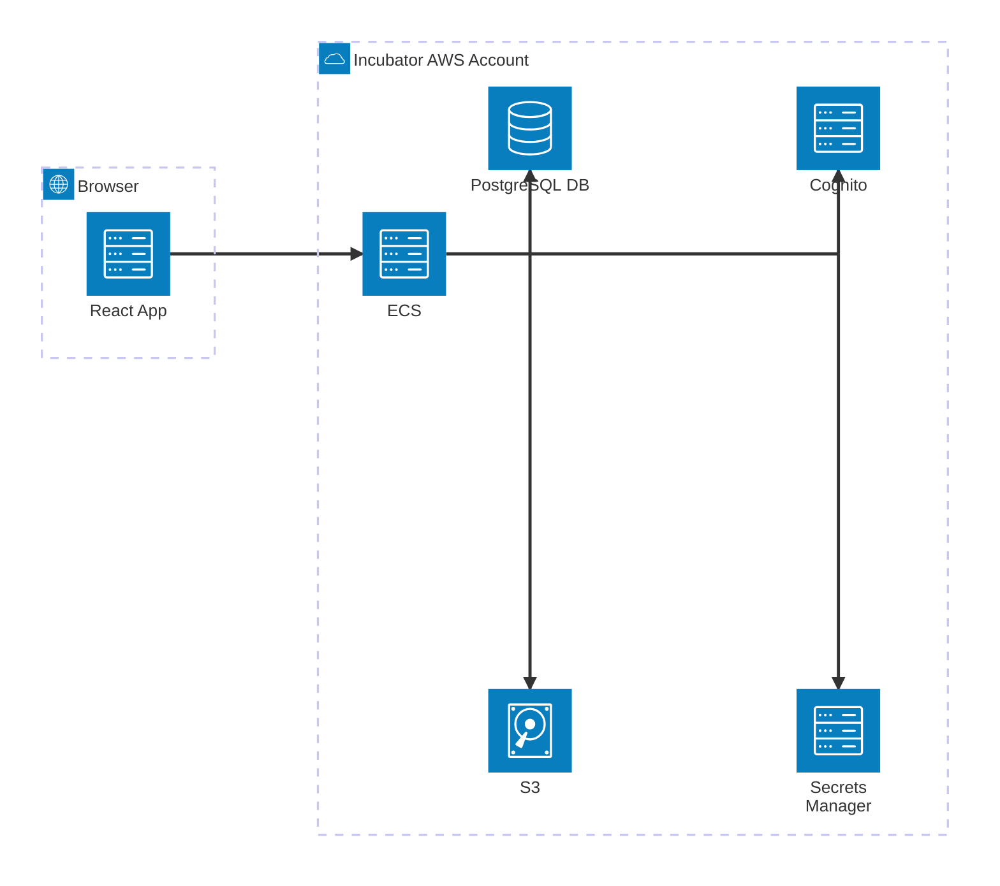

# Architecture Diagrams

### Infrastructure

```mermaid
architecture-beta
    group incubator(cloud)[Incubator AWS Account]
    group browser(internet)[Browser]

    service db(database)[PostgreSQL DB] in incubator
    service s3(disk)[S3] in incubator
    service cognito(server)[Cognito] in incubator
    service secrets(server)[Secrets Manager] in incubator
    service api(server)[ECS] in incubator
    service app(server)[React App] in browser

    junction junctionCenter
    junction junctionRight

    app:R --> L:api
    api:R -- L:junctionCenter
    junctionCenter:R -- L:junctionRight
    junctionCenter:T --> B:db
    junctionCenter:B --> T:s3
    junctionRight:T --> B:cognito
    junctionRight:B --> T:secrets

```