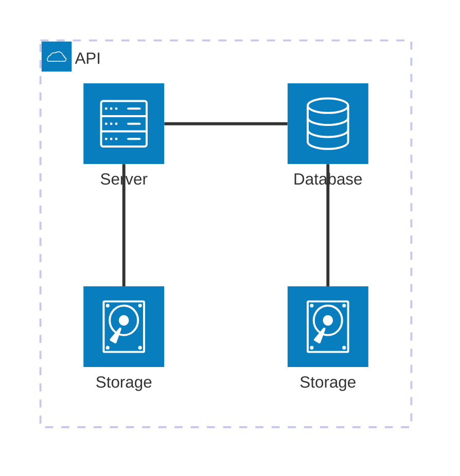

# Architecture Diagrams

### Infrastructure


<!-- ```mermaid
architecture-beta
    group backend(cloud)[Incubator]
    group postgres(database)[RDS] (in backend)
    group cognito(server)[Cognito] (in backend)
    group ecs(server)[ECS] (in backend)
    group frontend(server)[Browser]

    service api(server)[FastAPI Server] in ecs
    service app(server)[React App] in frontend
    
    api:T -- B:postgres
    api:L -- R:cognito

    app:T --> B:api

``` -->