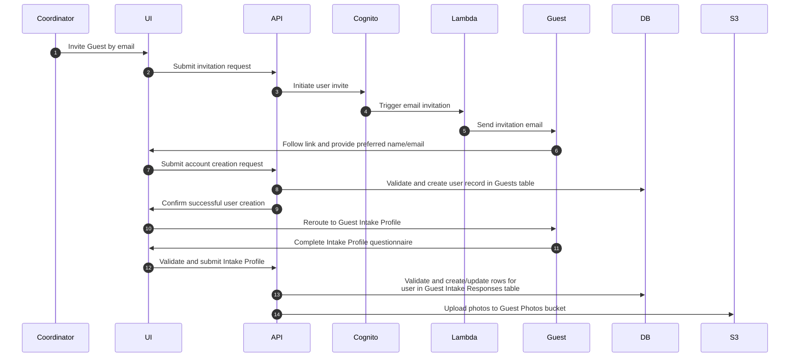
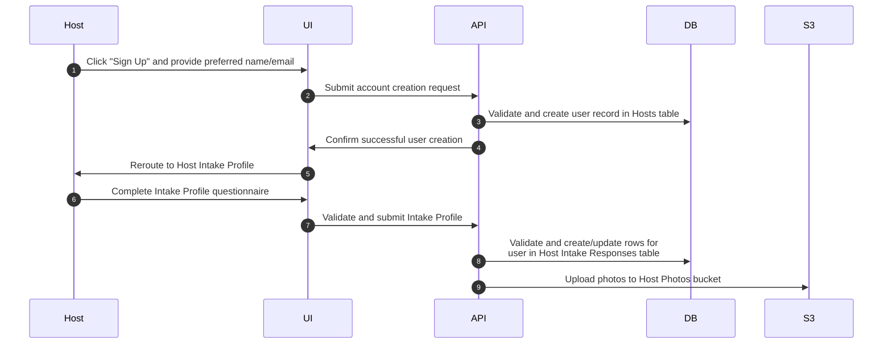

# Sequence Diagrams

### Guest

```mermaid
sequenceDiagram
    autonumber
    Coordinator->>UI: Invite Guest by email
    UI->>API: Submit invitation request
    API->>Cognito: Initiate user invite
    Cognito->>Lambda: Trigger email invitation
    Lambda->>Guest: Send invitation email
    Guest->>UI: Follow link and provide preferred name/email
    UI->>API: Submit account creation request
    API->>DB: Validate and create user record in Guests table
    API->>UI: Confirm successful user creation
    UI->>Guest: Reroute to Guest Intake Profile
    Guest->>UI: Complete Intake Profile questionnaire
    UI->>API: Validate and submit Intake Profile
    API->>DB: Validate and create/update rows for<br>user in Guest Intake Responses table
    API->>S3: Upload photos to Guest Photos bucket
```

### Host

```mermaid
sequenceDiagram
    autonumber
    Host->>UI: Click "Sign Up" and provide preferred name/email
    UI->>API: Submit account creation request
    API->>DB: Validate and create user record in Hosts table
    API->>UI: Confirm successful user creation
    UI->>Host: Reroute to Host Intake Profile
    Host->>UI: Complete Intake Profile questionnaire
    UI->>API: Validate and submit Intake Profile
    API->>DB: Validate and create/update rows for<br>user in Host Intake Responses table
    API->>S3: Upload photos to Host Photos bucket
```

##### As SVG

